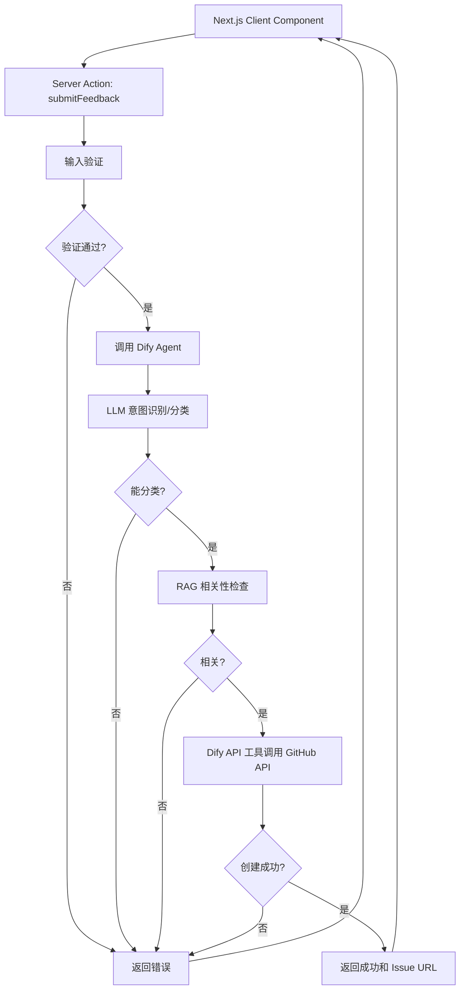

# 设计文档

## 概述

用户反馈系统是一个基于 Next.js 的全栈应用，它接收用户提交的反馈内容，通过 Next.js API Routes 调用 Dify 定义的 Agent 进行自动分类和产品相关性验证，然后将有效反馈创建为 GitHub Issue。系统确保只有相关且可分类的反馈被持久化，管理员可以直接在 GitHub 中查看和管理所有反馈。

## 技术栈

- **前端**: Next.js (React) with App Router
- **后端**: Next.js Server Actions
- **AI Agent**: Dify 平台定义的 Agent
  - LLM 实现意图识别和分类
  - RAG 实现产品相关性检查
  - API 工具调用 GitHub API 创建 Issue
- **存储**: GitHub Issues
- **部署**: Vercel

## 架构

系统采用 Next.js App Router 架构，使用 Server Actions 处理后端逻辑：

1. **前端层 (Next.js Client Component)** - 用户界面，收集反馈输入
2. **Server Actions** - 服务器端函数，处理反馈提交逻辑
3. **AI 处理层 (Dify Agent)** - 使用 LLM 进行分类，使用 RAG 进行相关性判断，使用 API 工具创建 GitHub Issue



## 组件和接口

### 1. 前端组件 (Next.js Client Component)

#### FeedbackForm

用户反馈表单组件。

**文件位置:** `app/components/FeedbackForm.tsx`

**接口:**
```typescript
'use client';

interface FeedbackFormProps {
  onSubmit: (content: string) => Promise<FeedbackResponse>;
}

interface FeedbackFormState {
  content: string;
  isLoading: boolean;
  message?: string;  // 成功或错误的提示信息
  success?: boolean;
}
```

**职责:**
- 渲染反馈输入表单
- 客户端基本验证（非空、长度限制）
- 调用 Server Action 提交反馈
- 显示提交状态和结果
- 处理用户交互

### 2. Server Actions

#### submitFeedback

处理反馈提交的服务器端函数。

**文件位置:** `app/actions/feedback.ts`

**接口:**
```typescript
'use server';

export async function submitFeedback(content: string): Promise<FeedbackResponse> {
  // 实现逻辑
}

interface FeedbackResponse {
  success: boolean;
  message: string;  // Dify Agent 返回的完整用户提示信息
}
```

**职责:**
- 接收客户端请求
- 验证输入
- 调用 Dify Agent
- 返回结果

**优势:**
- 自动序列化和类型安全
- 无需手动定义 API 端点
- 更好的代码组织和复用
- 自动处理 CSRF 保护

### 3. FeedbackValidator

负责验证反馈内容的基本格式和安全性。

**接口:**
```typescript
interface FeedbackValidator {
  validate(content: string): ValidationResult;
  sanitize(content: string): string;
}

interface ValidationResult {
  isValid: boolean;
  error?: string;
}
```

**职责:**
- 检查反馈内容是否为空
- 检查反馈长度是否超过限制（最大 5000 字符）
- 清理恶意脚本和不安全字符

### 4. DifyAgentClient

与 Dify Agent 交互的客户端。

**接口:**
```typescript
interface DifyAgentClient {
  processFeedback(content: string): Promise<DifyAgentResult>;
}

interface DifyAgentResult {
  success: boolean;
  message: string;  // Dify Agent 返回的完整用户提示信息（包含 Issue 编号或错误说明）
}
```

**职责:**
- 调用 Dify Agent API
- 传递反馈内容
- Dify Agent 内部完成：
  - LLM 分析和分类（无法分类时返回用户提示信息）
  - RAG 相关性检查（不相关时返回用户提示信息）
  - 调用 GitHub API 创建 Issue
- 接收并返回完整结果（Issue 编号和用户提示信息）
- 处理 Dify API 错误

**Dify Agent 工作流配置:**
1. **LLM 节点**: 分析反馈内容，识别意图和类型（bug/enhancement/question），如果无法分类则返回用户提示信息
2. **RAG 节点**: 基于产品文档检查相关性，如果不相关则返回用户提示信息
3. **API 工具节点**: 调用 GitHub API 创建 Issue，设置标题、正文和标签
4. **输出节点**: 返回 Issue 编号和用户提示信息

### 5. FeedbackService

协调所有组件的主服务（在 Server Action 中使用）。

**文件位置:** `lib/services/feedbackService.ts`

**接口:**
```typescript
interface FeedbackService {
  submitFeedback(content: string): Promise<SubmissionResult>;
}

interface SubmissionResult {
  success: boolean;
  message: string;  // 用户提示信息
}
```

**职责:**
- 协调整个反馈处理流程
- 调用验证器进行基本验证
- 调用 Dify Agent 完成分类、相关性检查和 Issue 创建
- 返回最终结果

**使用示例:**
```typescript
// app/actions/feedback.ts
'use server';

import { FeedbackService } from '@/lib/services/feedbackService';

export async function submitFeedback(content: string) {
  const service = new FeedbackService();
  return await service.submitFeedback(content);
}
```

## 数据模型

由于所有的分类、相关性检查和 GitHub Issue 创建都由 Dify Agent 完成，系统本身不需要复杂的数据模型。主要的数据交互通过接口定义完成：

### 输入数据

```typescript
// 用户提交的原始反馈
interface FeedbackInput {
  content: string;  // 反馈内容
}
```

### 输出数据

```typescript
// 系统返回给用户的结果
interface FeedbackResponse {
  success: boolean;
  message: string;  // Dify Agent 返回的完整用户提示信息（已包含 Issue 编号等所有信息）
}
```

## 文件结构

```
app/
├── actions/
│   └── feedback.ts           # Server Actions
├── components/
│   └── FeedbackForm.tsx      # 反馈表单组件
├── page.tsx                  # 主页面
lib/
├── services/
│   └── feedbackService.ts    # 反馈服务
├── clients/
│   └── difyClient.ts         # Dify Agent 客户端
└── validators/
    └── feedbackValidator.ts  # 输入验证器
```

## 错误处理

系统定义以下错误类型：

1. **ValidationError** - 输入验证失败
   - 空内容
   - 内容过长
   - 包含不安全字符

2. **DifyAgentError** - Dify Agent 调用失败
   - Agent 服务不可用
   - 网络错误
   - API 认证失败
   - 超时错误

所有错误都应返回清晰的错误信息，帮助用户理解问题并采取相应行动。对于 Dify Agent 返回的业务逻辑错误（如无法分类、不相关等），这些会作为成功响应返回，包含在 message 字段中。

## 测试策略

### 单元测试

针对每个组件编写单元测试：
- **FeedbackValidator**: 测试各种输入格式和边界情况（空内容、超长内容、特殊字符等）
- **DifyAgentClient**: 测试 Dify API 调用和错误处理（模拟成功和失败场景）
- **FeedbackService**: 测试完整流程（验证 → Dify Agent → 返回结果）
- **FeedbackForm**: 测试前端组件的用户交互和状态管理

### 属性测试

使用属性测试验证系统的通用正确性属性，确保系统在各种输入下都能正确运行。我们将使用 fast-check 库进行属性测试，每个测试运行至少 100 次迭代。


## 正确性属性

属性是一种特征或行为，应该在系统的所有有效执行中保持为真——本质上是关于系统应该做什么的形式化陈述。属性是人类可读规范和机器可验证正确性保证之间的桥梁。

### 属性 1: 输入清理

*对于任何* 包含脚本标签或特殊 HTML 字符的反馈内容，清理后的内容应该不包含这些不安全字符。

**验证: 需求 1.4**

### 属性 2: 有效输入接受

*对于任何* 非空且长度在限制内的反馈内容，如果分类成功且相关性检查通过，系统应该返回成功结果。

**验证: 需求 1.1**

### 属性 3: 空白输入拒绝

*对于任何* 仅由空白字符（空格、制表符、换行符）组成的字符串，系统应该拒绝提交并返回验证错误。

**验证: 需求 1.2**

### 属性 4: 分类结果约束

*对于任何* 反馈内容，分类器返回的类型应该是 'bug'、'enhancement'、'question' 之一，或者是 null（表示无法分类）。

**验证: 需求 2.2**

### 属性 5: Issue 创建完整性

*对于任何* 通过验证、分类和相关性检查的反馈，创建的 GitHub Issue 应该满足：
- 标题是反馈内容的前 50 个字符（如果内容少于 50 字符则使用全部内容）
- 正文是完整的反馈内容
- 包含与分类类型对应的标签
- 包含 "user-feedback" 标签

**验证: 需求 4.1, 4.2, 4.3, 4.4, 6.3**

### 属性 6: 标签映射正确性

*对于任何* 反馈类型和创建的 Issue，标签映射应该满足：
- 类型为 'bug' 时，Issue 包含 'bug' 标签
- 类型为 'enhancement' 时，Issue 包含 'enhancement' 标签
- 类型为 'question' 时，Issue 包含 'question' 标签

**验证: 需求 5.1, 5.2, 5.3**

### 属性 7: 统一标签存在

*对于任何* 通过系统创建的 GitHub Issue，都应该包含 "user-feedback" 标签。

**验证: 需求 5.4**


## 配置管理

系统需要以下配置项（通过 `.env.local` 文件提供）：

```typescript
interface FeedbackConfig {
  github: {
    token: string;           // GitHub API 访问令牌 (GITHUB_TOKEN)
    owner: string;           // 仓库所有者 (GITHUB_OWNER)
    repo: string;            // 仓库名称 (GITHUB_REPO)
  };
  validation: {
    maxLength: number;       // 最大反馈长度（默认 5000）
    minLength: number;       // 最小反馈长度（默认 1）
  };
  dify: {
    apiEndpoint: string;     // Dify API 端点 (DIFY_API_ENDPOINT)
    apiKey: string;          // Dify API 密钥 (DIFY_API_KEY)
    agentId: string;         // Dify Agent ID (DIFY_AGENT_ID)
  };
}
```

**环境变量文件 (.env.local):**
```bash
# GitHub 配置
GITHUB_TOKEN=ghp_xxxxxxxxxxxx
GITHUB_OWNER=your-org
GITHUB_REPO=your-repo

# Dify 配置
DIFY_API_ENDPOINT=https://api.dify.ai/v1
DIFY_API_KEY=app-xxxxxxxxxxxx
DIFY_AGENT_ID=agent-xxxxxxxxxxxx

# 验证配置
FEEDBACK_MAX_LENGTH=5000
```

**配置读取示例:**
```typescript
// lib/config.ts
export const config = {
  github: {
    token: process.env.GITHUB_TOKEN!,
    owner: process.env.GITHUB_OWNER!,
    repo: process.env.GITHUB_REPO!,
  },
  dify: {
    apiEndpoint: process.env.DIFY_API_ENDPOINT!,
    apiKey: process.env.DIFY_API_KEY!,
    agentId: process.env.DIFY_AGENT_ID!,
  },
  validation: {
    maxLength: parseInt(process.env.FEEDBACK_MAX_LENGTH || '5000'),
    minLength: 1,
  },
};
```

**注意事项:**
- `.env.local` 文件不应提交到版本控制（已在 `.gitignore` 中）
- 生产环境配置通过 Vercel 环境变量设置
- 开发环境使用 `.env.local` 文件
- 所有必需的环境变量应在应用启动时验证

## 性能考虑

1. **Dify Agent 调用** - LLM 和 RAG 处理可能需要几秒钟，应该设置合理的超时时间（建议 15 秒）
2. **GitHub API 限流** - 注意 GitHub API 的速率限制（每小时 5000 次），考虑实现重试机制
3. **前端体验** - 使用 loading 状态和进度提示，提升用户体验
4. **并发处理** - Next.js API Routes 可以处理并发请求，但注意 Dify API 的并发限制

## 安全考虑

1. **输入清理** - 必须清理所有用户输入，防止 XSS 攻击
2. **API 密钥管理** - GitHub token 和 Dify API 密钥应该存储在环境变量中，不应暴露在客户端代码或日志中
3. **错误信息** - 错误信息不应泄露系统内部细节（如 API 密钥、内部路径等）
4. **Server Actions 安全** - Server Actions 自动提供 CSRF 保护，确保只能从同源调用
5. **速率限制** - 考虑在 Server Action 层面实现速率限制，防止滥用
6. **环境变量验证** - 在应用启动时验证所有必需的环境变量是否存在

## 部署

### Vercel 部署

应用将部署到 Vercel 平台，利用其无服务器架构和全球 CDN。

**部署配置:**

1. **环境变量设置** - 在 Vercel 项目设置中配置所有必需的环境变量：
   - `GITHUB_TOKEN`
   - `GITHUB_OWNER`
   - `GITHUB_REPO`
   - `DIFY_API_ENDPOINT`
   - `DIFY_API_KEY`
   - `DIFY_AGENT_ID`
   - `FEEDBACK_MAX_LENGTH`

2. **构建设置:**
   - Framework Preset: Next.js
   - Build Command: `npm run build` 或 `yarn build`
   - Output Directory: `.next`
   - Install Command: `npm install` 或 `yarn install`

3. **Server Actions 配置:**
   - Server Actions 在 Vercel 上作为服务器端代码运行
   - 自动处理 CSRF 保护和请求验证
   - 考虑 Dify Agent 处理时间，确保响应时间在合理范围内

4. **域名配置:**
   - 使用 Vercel 提供的默认域名或配置自定义域名
   - 自动 HTTPS 证书

**部署流程:**

```bash
# 1. 连接 GitHub 仓库到 Vercel
# 2. 配置环境变量
# 3. 触发部署（自动或手动）
# 4. Vercel 自动构建和部署

# 或使用 Vercel CLI
npm install -g vercel
vercel --prod
```

**注意事项:**
- 确保所有环境变量在 Vercel 中正确配置
- 使用 Vercel 的预览部署功能测试变更
- 监控 Vercel 的函数执行时间和错误日志
- 注意 Vercel Serverless Functions 的限制（请求大小、执行时间等）

## 实现注意事项

1. **错误处理** - 实现完善的错误处理和用户友好的错误提示
2. **日志记录** - 记录所有关键操作和错误，便于调试和监控（注意不要记录敏感信息）
3. **监控指标** - 跟踪成功率、失败原因、处理时间等指标
4. **降级策略** - 当 Dify Agent 不可用时，考虑是否需要降级方案（如暂存到队列）
5. **TypeScript 类型安全** - 充分利用 TypeScript 的类型系统，确保类型安全
6. **测试环境** - 使用测试仓库进行开发和测试，避免污染生产环境
7. **Vercel 限制** - 注意 Vercel Serverless Functions 的执行时间限制，确保 Dify Agent 调用在限制内完成
